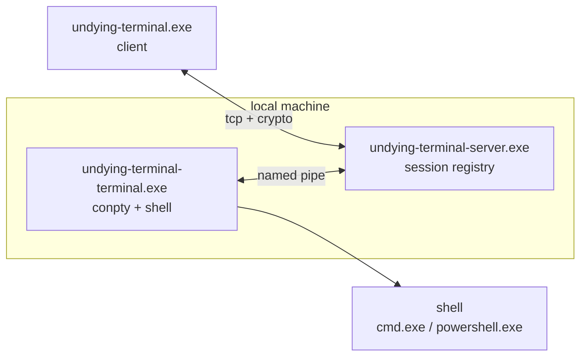
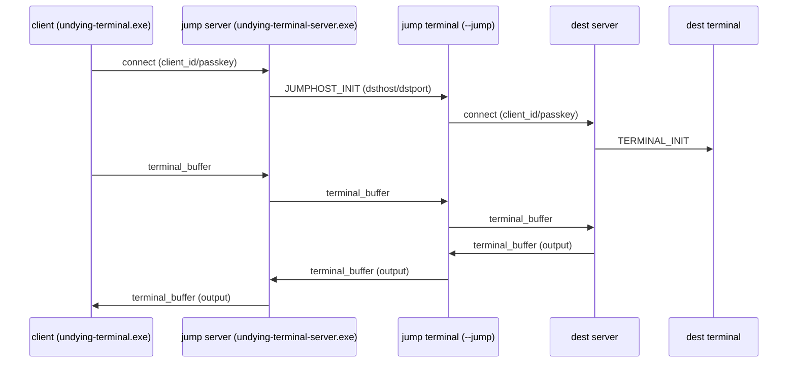

<div align="center">
  
  
  <h1>Undying Terminal</h1>
  
  <p><strong>reconnectable secure remote shell, on Windows</strong></p>

  <p>
    <a href="LICENSE">
      
    </a>
    
    
    
  </p>

  <br />
</div>


## quick links

- docs: https://undyingterminal.com/docs/
- releases: https://github.com/Microck/UndyingTerminal/releases
- issues: https://github.com/Microck/UndyingTerminal/issues

## what

- you run a local server + local terminal.
- clients connect over tcp (direct or bootstrapped via ssh).
- session stays alive via keepalive + reconnect + recovery.
- supports forward tunnels and reverse tunnels.
- supports a jump host hop (client -> jump server -> destination).

## why

ssh sessions die at the worst times. close your laptop, switch wifi, flip a vpn, and your shell is gone.

undying terminal assumes disconnects will happen and focuses on recovery:
- the session stays alive on the server.
- reconnecting replays missed output and keeps your shell state.

if you just want the 5-minute setup, start here: https://undyingterminal.com/docs/quickstart

## how it works



## quick start (windows)

prereq
- use windows terminal or cmd/powershell
- windows 10 build 17763+ (conpty)
- download the latest release binaries: https://github.com/Microck/UndyingTerminal/releases/latest

install (once)
- extract the zip somewhere like `C:\Program Files\UndyingTerminal`
- optional: add that directory to your PATH
- verify you have `undying-terminal.exe`, `undying-terminal-server.exe`, `undying-terminal-terminal.exe`

full install guide: https://undyingterminal.com/docs/installation

run

```powershell
# 1) start server (listens on 2022 by default)
./undying-terminal-server.exe

# 2) start terminal (prints id/passkey once)
echo "XXX/ignored" | ./undying-terminal-terminal.exe

# 3) connect (interactive)
./undying-terminal.exe --connect 127.0.0.1 2022 <client_id> --key <passkey> --noexit
```

one-shot command

```powershell
# note: include newline for cmd.exe
./undying-terminal.exe --connect 127.0.0.1 2022 <client_id> --key <passkey> -c "echo hi`r`n"
```

## ssh bootstrap

this starts a remote terminal over ssh, then connects to the local server.

```powershell
./undying-terminal.exe --ssh <host> -l <user>
```

tmux integration (for tmux-capable remote hosts):

```powershell
./undying-terminal.exe --ssh <host> -l <user> --tmux --tmux-session devshell
```

more: https://undyingterminal.com/docs/guides/ssh-bootstrap

## build from source

prereq
- visual studio 2019+ (c++ desktop development workload)
- cmake 3.20+
- ninja
- vcpkg (included in this repo under `vcpkg/`)

```powershell
git clone https://github.com/Microck/UndyingTerminal.git
cd UndyingTerminal

.\vcpkg\bootstrap-vcpkg.bat

cmake --preset windows-vcpkg-static
cmake --build --preset windows-vcpkg-static
```

full build notes: https://undyingterminal.com/docs/installation

## jumphost

mental model
- client connects to jump server.
- jump server tells its local terminal to proxy to the destination.
- jump terminal connects to destination server and shuttles packets.



note
- you only need `UT_PIPE_NAME` when running multiple servers on one machine (dev).

more: https://undyingterminal.com/docs/guides/jumphost

## tunnels

forward tunnels
- `-t/--tunnel`: open local ports that forward through the session.

reverse tunnels
- `-r/--reversetunnel`: server listens; when hit, it requests the client to connect to a destination and shuttles data.

more: https://undyingterminal.com/docs/guides/port-forwarding

## built-in ui and multi-session

you can run a built-in text UI from the client executable:

```powershell
./undying-terminal.exe --ui
```

inside the UI, create and manage multiple sessions:

```text
add <name> <host> <port> <client_id> <passkey>
start <name>
list
```

## predictive echo

for high-latency links, enable local predictive echo on connect:

```powershell
./undying-terminal.exe --connect <host> <port> <client_id> --key <passkey> --predictive-echo --noexit
```

## config

file
- `%PROGRAMDATA%\UndyingTerminal\ut.cfg`

keys

```ini
port=2022
bind_ip=0.0.0.0
verbose=false
```

env
- `UT_PIPE_NAME` override named pipe path (dev / multi-server).
- `UT_DEBUG_HANDSHAKE=1` prints packet-level debug.

more: https://undyingterminal.com/docs/config/server-config

## troubleshooting

start with:
- https://undyingterminal.com/docs/troubleshooting/common-issues
- https://undyingterminal.com/docs/troubleshooting/faq

and if you need logs:

```powershell
$env:UT_DEBUG_HANDSHAKE=1
./undying-terminal.exe --connect ...
```

## recent additions (v1.1.0)

- **built-in terminal ui** (`--ui`) for managing multiple sessions
- **multi-session support** with named profiles and concurrent processes
- **ipv6 support** for future-proof networking
- **predictive echo** (`--predictive-echo`) for high-latency connections
- **tmux integration** (`--tmux`, `--tmux-session`) for seamless tmux workflows
- **tunnel-only mode** (`--tunnel-only`) for port forwarding without terminal overhead
- **static linking** - executables no longer require external DLLs

### v1.0.1

- ssh config parsing (`~/.ssh/config`) with support for:
  - `HostName`, `User`, `Port`, `IdentityFile`
  - `ProxyJump` for jump host connections
  - `LocalForward` for port forwarding from config
  - `ForwardAgent` for ssh-agent forwarding
- server cleanup on pipe disconnect
- `--ssh-config`, `--no-ssh-config` CLI options
- `-A`/`--ssh-agent`, `--no-ssh-agent` CLI options

track work in issues: https://github.com/Microck/UndyingTerminal/issues

## license

mit. see `LICENSE`.
