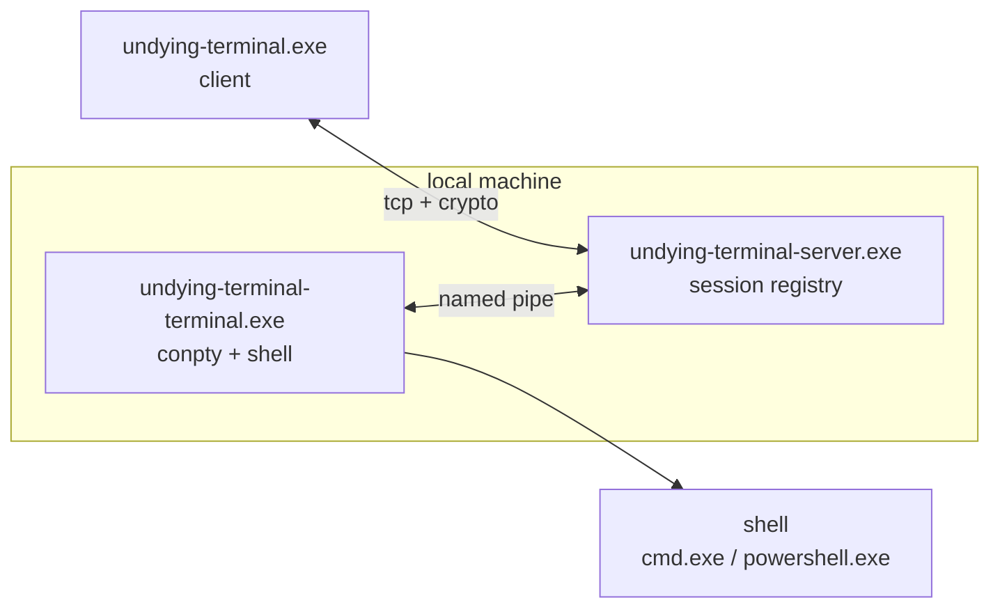
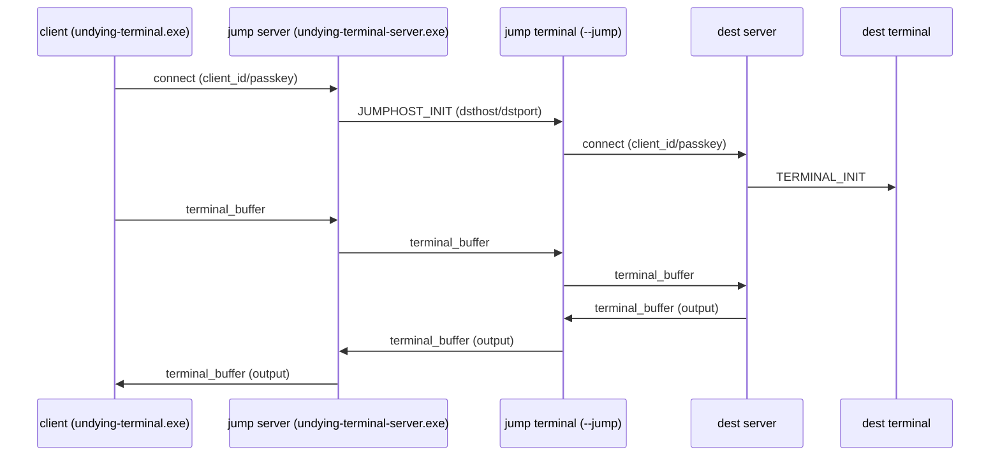

<div align="center">
  
  
  <h1>Undying Terminal</h1>
  
  <p><strong>reconnectable secure remote shell, on Windows</strong></p>

  <p>
    <a href="LICENSE">
      
    </a>
    
    
    
  </p>

  <br />
</div>

- docs: https://undyingterminal.mintlify.app/
- releases: https://github.com/Microck/UndyingTerminal/releases
- issues: https://github.com/Microck/UndyingTerminal/issues

## what

- you run a local server + local terminal.
- clients connect over tcp (direct or bootstrapped via ssh).
- session stays alive via keepalive + reconnect + recovery.
- supports forward tunnels and reverse tunnels.
- supports a jump host hop (client -> jump server -> destination).

## how it works



## quick start (windows)

prereq
- use windows terminal or cmd/powershell.

run

```powershell
# 1) start server (listens on 2022 by default)
./undying-terminal-server.exe

# 2) start terminal (prints id/passkey once)
echo "XXX/ignored" | ./undying-terminal-terminal.exe

# 3) connect (interactive)
./undying-terminal.exe --connect 127.0.0.1 2022 <client_id> --key <passkey> --noexit
```

one-shot command

```powershell
# note: include newline for cmd.exe
./undying-terminal.exe --connect 127.0.0.1 2022 <client_id> --key <passkey> -c "echo hi`r`n"
```

## ssh bootstrap

this starts a remote terminal over ssh, then connects to the local server.

```powershell
./undying-terminal.exe --ssh <host> -l <user>
```

## jumphost

mental model
- client connects to jump server.
- jump server tells its local terminal to proxy to the destination.
- jump terminal connects to destination server and shuttles packets.



note
- you only need `UT_PIPE_NAME` when running multiple servers on one machine (dev).

## tunnels

forward tunnels
- `-t/--tunnel`: open local ports that forward through the session.

reverse tunnels
- `-r/--reversetunnel`: server listens; when hit, it requests the client to connect to a destination and shuttles data.

## config

file
- `%PROGRAMDATA%\UndyingTerminal\ut.cfg`

keys

```ini
port=2022
bind_ip=0.0.0.0
verbose=false
```

env
- `UT_PIPE_NAME` override named pipe path (dev / multi-server).
- `UT_DEBUG_HANDSHAKE=1` prints packet-level debug.

## limitations (still missing)

- ssh config parsing (proxyjump/localforward)
- ssh-agent forwarding
- server cleanup on pipe disconnect

## license

mit. see `LICENSE`.
