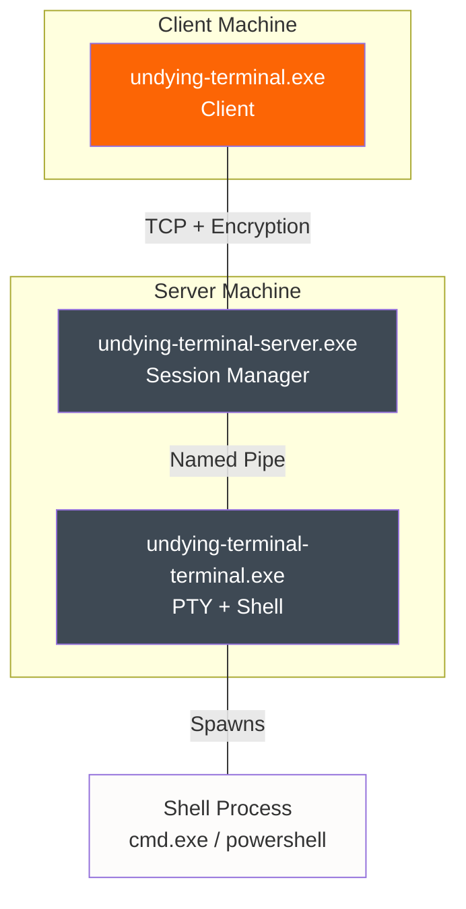

## System Architecture

Undying Terminal implements a **three-component distributed architecture** designed for session persistence and network resilience.



## Design Principles

### 1. Session Persistence First

Unlike traditional SSH clients, Undying Terminal prioritizes **session survival** over raw performance:

- Sessions survive network disconnects, sleep/wake, VPN switches
- Sequence-based recovery ensures no data loss (up to 64MB buffer)
- Automatic reconnection with exponential backoff

<Info>
**Design Trade-off**: Buffering adds minimal latency (~1-2ms) but enables bulletproof recovery.
</Info>

### 2. Component Separation

The three-component split enables:

- **Decoupled lifecycle**: Server runs continuously; clients/terminals reconnect
- **Named pipe isolation**: Terminals connect locally; clients connect remotely
- **Process isolation**: Shell crashes don't affect server or client

### 3. Recovery Over Reliability

Traditional approach: Make connections **reliable** (don't drop)  
Undying Terminal: Assume connections **will fail**; focus on recovery

This mindset shift enables:
- Graceful handling of network instability
- Transparent reconnection
- Zero user intervention

## Components

### Server: `undying-terminal-server.exe`

<CardGroup cols={2}>
  <Card title="Responsibilities" icon="server">
    - TCP listener (default port 2022)
    - Named pipe server for terminal registration
    - Client registry (client_id → session mapping)
    - Passkey authentication
    - Packet relay (terminal ↔ client)
  </Card>
  
  <Card title="Key Features" icon="bolt">
    - Multi-client support (one server, many sessions)
    - Session recovery coordination
    - Encryption endpoint (optional)
    - Windows service mode
  </Card>
</CardGroup>

#### Architecture

```cpp
// Simplified architecture
class Server {
    TcpListener tcp_listener_;          // Port 2022
    NamedPipeServer pipe_server_;       // \\.\pipe\undying-terminal
    ClientRegistry registry_;           // client_id → session
    
    void HandleClientConnection(Socket sock);
    void HandleTerminalRegistration(Pipe pipe);
};
```

**Threading Model:**
- Main thread: Accept loop (TCP + named pipe)
- Per-client thread: Packet relay
- Per-terminal thread: Pipe I/O

### Terminal: `undying-terminal-terminal.exe`

<CardGroup cols={2}>
  <Card title="Responsibilities" icon="terminal">
    - ConPTY session management
    - Shell process spawning (cmd.exe, powershell.exe)
    - Named pipe client (connects to server)
    - Terminal I/O relay
  </Card>
  
  <Card title="Key Features" icon="bolt">
    - Windows ConPTY integration
    - Terminal resize handling
    - Jumphost proxy mode (--jump)
    - Client ID/passkey generation
  </Card>
</CardGroup>

#### Architecture

```cpp
// Simplified architecture
class ConPTYSession {
    HPCON hpc_;                        // ConPTY handle
    HANDLE hProcess_;                  // Shell process
    
    void Write(const std::string& data);
    std::string Read();
    void Resize(int rows, int cols);
};

// Terminal main loop
1. Generate client_id + passkey
2. Connect to server via named pipe
3. Send TerminalUserInfo
4. Start ConPTY with shell
5. Relay: ConPTY ↔ named pipe
```

**Jumphost Mode:**
When started with `--jump`, terminal acts as a proxy:
```
Terminal receives JUMPHOST_INIT(dsthost, dstport)
  → Connects to destination server
  → Relays packets: named pipe ↔ destination TCP
```

### Client: `undying-terminal.exe`

<CardGroup cols={2}>
  <Card title="Responsibilities" icon="desktop">
    - User I/O (stdin/stdout)
    - TCP connection to server
    - Reconnection logic
    - Keepalive sender
    - Port forwarding orchestration
  </Card>
  
  <Card title="Key Features" icon="bolt">
    - SSH bootstrap mode (--ssh)
    - Tunnel management (-t, -r)
    - One-shot command execution (-c)
    - Recovery protocol
  </Card>
</CardGroup>

#### Architecture

```cpp
// Simplified architecture
class ClientConnection : public Connection {
    void Reconnect();                   // Exponential backoff
    void SendKeepalive();               // Every 5s
    void RecoverSession();              // Sequence-based catchup
};

// Client main loop
1. Connect to server (NEW_CLIENT or RETURNING_CLIENT)
2. If RETURNING_CLIENT: Recovery handshake
3. Send INITIAL_PAYLOAD (tunnels, env vars)
4. Relay: stdin ↔ connection ↔ stdout
5. If disconnect: Reconnect() with backoff
```

## Communication Protocols

### TCP Communication (Client ↔ Server)

**Packet Structure:**
```
┌─────────────┬──────────┬────────────────┐
│ encrypted   │ header   │ payload        │
│ (1 byte)    │ (1 byte) │ (variable)     │
└─────────────┴──────────┴────────────────┘
```

- `encrypted`: 0x00 (plaintext) or 0x01 (encrypted)
- `header`: Packet type (see EtPacketType/TerminalPacketType)
- `payload`: Protobuf-serialized message

**Framing (length-prefixed):**
```
┌────────────┬─────────────────────┐
│ length     │ packet              │
│ (4 bytes)  │ (length bytes)      │
└────────────┴─────────────────────┘
```

### Named Pipe Communication (Terminal ↔ Server)

Uses same packet structure, but transport is Windows named pipe:

- Pipe name: `\\.\pipe\undying-terminal` (configurable via `UT_PIPE_NAME`)
- Connection: Terminal connects; server accepts
- I/O: Synchronous reads/writes

## Data Flow

### Initial Connection Flow

<Steps>
  <Step title="Terminal Registration">
    ```mermaid
    sequenceDiagram
        participant T as Terminal
        participant S as Server
        
        T->>S: Connect to named pipe
        T->>S: TerminalUserInfo(id, passkey)
        S->>T: TERMINAL_INIT
        Note over S: Registry: client_id → (terminal, passkey)
    ```
  </Step>
  
  <Step title="Client Handshake">
    ```mermaid
    sequenceDiagram
        participant C as Client
        participant S as Server
        
        C->>S: ConnectRequest(client_id, version=6)
        S->>C: ConnectResponse(status=NEW_CLIENT)
        C->>S: INITIAL_PAYLOAD(tunnels, env)
        S->>C: INITIAL_RESPONSE
    ```
  </Step>
  
  <Step title="Session Active">
    ```mermaid
    sequenceDiagram
        participant C as Client
        participant S as Server
        participant T as Terminal
        participant SH as Shell
        
        C->>S: TERMINAL_BUFFER("ls")
        S->>T: TERMINAL_BUFFER("ls")
        T->>SH: Write to ConPTY
        SH->>T: Output
        T->>S: TERMINAL_BUFFER(output)
        S->>C: TERMINAL_BUFFER(output)
    ```
  </Step>
</Steps>

### Reconnection Flow

<Steps>
  <Step title="Disconnect Detected">
    Client detects disconnect (3 missed keepalives or socket error)
  </Step>
  
  <Step title="Reconnect with Backoff">
    ```mermaid
    sequenceDiagram
        participant C as Client
        participant S as Server
        
        Note over C: Wait 100ms (backoff)
        C->>S: ConnectRequest(client_id, version=6)
        S->>C: ConnectResponse(status=RETURNING_CLIENT)
    ```
  </Step>
  
  <Step title="Recovery Handshake">
    ```mermaid
    sequenceDiagram
        participant C as Client
        participant S as Server
        
        C->>S: SequenceHeader(last_recv=N)
        S->>C: SequenceHeader(last_recv=M)
        
        Note over C: Prepare catchup: M+1..N
        Note over S: Prepare catchup: N+1..M
        
        C->>S: CatchupBuffer([packets M+1..N])
        S->>C: CatchupBuffer([packets N+1..M])
        
        Note over C,S: Session recovered!
    ```
  </Step>
</Steps>

## Sequence-Based Recovery

### How It Works

Each `Connection` maintains:

```cpp
class BackedReader {
    uint64_t sequence_number_;         // Last received seq
    std::deque<Packet> local_buffer_;  // Recent packets
};

class BackedWriter {
    uint64_t sequence_number_;         // Next send seq
    std::deque<Packet> backup_;         // Last 64MB
};
```

**Recovery Steps:**

1. **Client reconnects** → sends `last_recv=N` (last packet from server)
2. **Server responds** → sends `last_recv=M` (last packet from client)
3. **Catchup phase:**
   - Client resends packets `M+1` through `N` (missed by server)
   - Server resends packets `N+1` through `M` (missed by client)
4. **Resume normal operation**

<Warning>
**Buffer Limit**: Only last 64MB is buffered. If client disconnects for hours and server sends >64MB, some packets are lost. This is by design (bounded memory).
</Warning>

## Encryption

Optional **XSalsa20 symmetric encryption** via libsodium:

```cpp
// Key derivation
shared_key = SHA256(passkey)  // 32 bytes

// Per-packet encryption
nonce[0] = 0x00 (client→server) or 0x01 (server→client)
nonce[1..23] = packet_counter (auto-increment)

ciphertext = crypto_stream_xor(plaintext, nonce, shared_key)
```

**Security Notes:**
- Nonce MSB differentiates directions (prevents replay)
- Per-packet nonce increment ensures uniqueness
- No authentication (encryption only, not MAC)

<Tip>
For production use, enable encryption via `shared_key_hex` in config.
</Tip>

## Threading Model

### Server

```
Main Thread:
  ├─ TcpListener::Accept() [blocking]
  └─ NamedPipeServer::Accept() [blocking]

Per-Client Thread:
  └─ Connection::ReadPacket() / WritePacket()

Per-Terminal Thread:
  └─ NamedPipe I/O relay
```

### Client

```
Main Thread:
  ├─ stdin → Connection
  └─ Connection → stdout

Background Thread:
  └─ Keepalive sender (every 5s)

Reconnect Thread:
  └─ Spawned on disconnect
```

### Terminal

```
Main Thread:
  ├─ ConPTY input → NamedPipe
  └─ NamedPipe → ConPTY output

Shell Process:
  └─ cmd.exe / powershell.exe (child)
```

## Performance Characteristics

| Metric | Value | Notes |
|--------|-------|-------|
| **Latency Overhead** | ~1-2ms | Framing + sequence tracking |
| **Memory per Session** | ~5MB | Buffers + connection state |
| **Recovery Buffer** | 64MB | Per-direction (128MB total) |
| **Max Concurrent Sessions** | ~1000s | Limited by OS resources |
| **Keepalive Traffic** | ~200 bytes/5s | Minimal overhead |

<Info>
Latency overhead is negligible for interactive terminal use (&lt;5ms is imperceptible).
</Info>

## Scalability

### Horizontal Scaling

Not designed for horizontal scaling (single-server architecture). For high availability:

- Run multiple independent servers on different ports
- Use client-side failover (connect to backup server)

### Vertical Scaling

Server handles:
- ~1000 concurrent sessions on typical hardware (4-core, 8GB RAM)
- Limited by thread count and network bandwidth
- Each session: 1 thread + ~5MB memory

## Security Considerations

<Warning title="Security Notes">
1. **No authentication beyond passkey** - Use strong random passkeys
2. **Optional encryption** - Enable for internet-facing servers
3. **No MAC/AEAD** - Encryption provides confidentiality, not authenticity
4. **Passkey transmission** - Sent in plaintext during initial handshake (before encryption)
</Warning>

**Recommendations:**
- Enable `shared_key_hex` for production
- Use firewall rules to restrict access
- Consider VPN for sensitive environments
- Rotate passkeys periodically

## Limitations

### By Design

- Single-server architecture (no clustering)
- 64MB recovery buffer (bounded memory)
- Windows-only (ConPTY dependency)
- No SSH agent forwarding

### Planned Improvements

- [ ] SSH config parsing (ProxyJump, LocalForward)
- [ ] Server cleanup on pipe disconnect
- [ ] Cross-platform terminal component (Linux/macOS)
- [ ] AEAD encryption (authenticated encryption)

## Next Steps

<CardGroup cols={2}>
  <Card
    title="Component Details"
    icon="cube"
    href="/architecture/components"
  >
    Deep dive into each component
  </Card>
  
  <Card
    title="Protocol Specification"
    icon="file-code"
    href="/architecture/protocol"
  >
    Wire protocol and Protobuf messages
  </Card>
  
  <Card
    title="Network Flow Diagrams"
    icon="diagram-project"
    href="/architecture/network-flow"
  >
    Visualize packet flows
  </Card>
  
  <Card
    title="Configuration Guide"
    icon="gear"
    href="/config/server-config"
  >
    Configure server options
  </Card>
</CardGroup>
