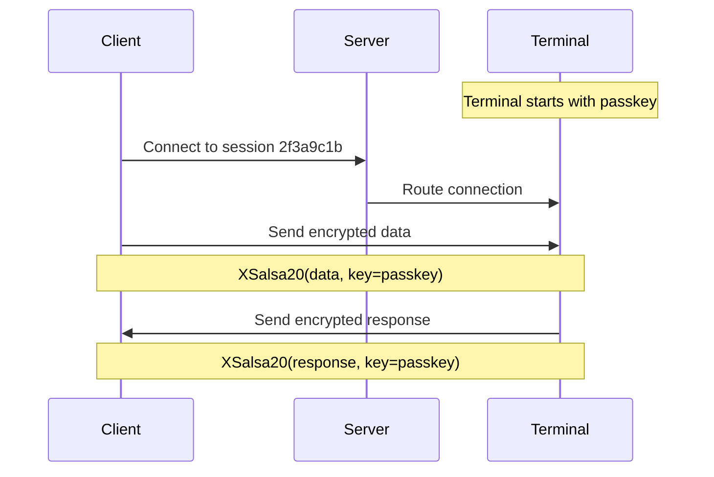

## Encryption Overview

Undying Terminal uses **XSalsa20** stream cipher for optional end-to-end encryption between client and terminal. All traffic passing through the server is encrypted when a passkey is configured.

## How It Works

### Key-Based Authentication

Instead of passwords or certificates, Undying Terminal uses a **shared secret** (passkey):

```
Passkey: 32-character hexadecimal string
Example: a7f3e9d2c8b4f1e0a3c7b9d5f2e8c1a4
```

**Key characteristics:**
- 128-bit security (256 hex characters = 128 bits)
- Symmetric: Same key used by client and terminal
- Generated randomly when terminal starts
- No key exchange protocol (pre-shared key model)

### Encryption Flow



### What Gets Encrypted

**Encrypted:**
- All terminal input (keystrokes, commands)
- All terminal output (command results, shell prompts)
- Control sequences (ANSI codes, cursor movements)

**Not encrypted:**
- Connection metadata (IP addresses, port numbers)
- Client ID (sent in plaintext to identify session)
- Server-to-terminal routing (local named pipe, same machine)

## XSalsa20 Cipher

### Why XSalsa20?

**Advantages:**
- Fast: ~2-3 GB/s throughput (software-only)
- Simple: Stream cipher, no complex key schedules
- Proven: Salsa20 family designed by Daniel J. Bernstein
- Extended nonce: 192-bit nonce prevents collisions

**Comparison:**

| Cipher | Speed | Nonce Size | Complexity |
|--------|-------|------------|------------|
| AES-256-GCM | ~1 GB/s | 96 bits | High (block cipher) |
| ChaCha20 | ~2 GB/s | 96 bits | Medium |
| **XSalsa20** | ~2.5 GB/s | 192 bits | Low |

### Implementation Details

**Nonce generation:**
- 192-bit random nonce per message
- Nonce sent in plaintext alongside ciphertext
- No nonce reuse (critical for stream ciphers)

**Message format:**
```
[Nonce (24 bytes)][Ciphertext (variable)][MAC (optional)]
```

**Performance impact:**
- Encryption adds ~0.1-0.2ms latency per message
- Negligible CPU usage (less than 1% on modern processors)
- No buffering delays

## Configuration

### Server-Side Configuration

**Require encryption for all sessions:**

```ini
# ut.cfg
require_key = true
```

When enabled:
- Clients MUST provide a valid passkey
- Unencrypted connections are rejected
- All traffic is encrypted end-to-end

**Allow optional encryption (default):**

```ini
# ut.cfg
require_key = false
```

When disabled:
- Clients CAN provide passkey (optional)
- Unencrypted connections accepted
- Mixed encrypted/unencrypted sessions on same server

### Client-Side Usage

**Connect with encryption:**

```powershell
./undying-terminal.exe `
  --connect 192.168.1.10 2022 2f3a9c1b `
  --key a7f3e9d2c8b4f1e0a3c7b9d5f2e8c1a4
```

**Connect without encryption (if server allows):**

```powershell
./undying-terminal.exe `
  --connect 192.168.1.10 2022 2f3a9c1b
```

### Terminal-Side Setup

**Generate passkey when starting terminal:**

```powershell
echo "a7f3e9d2c8b4f1e0a3c7b9d5f2e8c1a4" | ./undying-terminal-terminal.exe
```

**No encryption (local-only access):**

```powershell
echo "XXX" | ./undying-terminal-terminal.exe
```

The terminal displays the passkey on startup. Save it for client connections.

## Security Considerations

### Threat Model

**What encryption protects against:**

**Network eavesdropping:**
- Passive attackers on WiFi/LAN cannot read traffic
- ISP/network admins cannot see terminal content
- VPN providers cannot inspect sessions

**Man-in-the-middle (limited):**
- Attackers cannot decrypt traffic without passkey
- Attackers cannot inject valid encrypted commands

**What encryption does NOT protect against:**

**Server compromise:**
- Server operator can modify code to log passkeys
- Server machine compromise exposes all traffic (decrypted)

**Key theft:**
- If passkey is stolen, all past and future traffic is compromised
- No forward secrecy

**Client/terminal compromise:**
- Malware on client or server machines can read plaintext
- Keyloggers capture input before encryption

### Best Practices

**Key management:**

<CardGroup cols={2}>
  <Card title="DO" icon="check">
    - Generate random passkeys (use `openssl rand -hex 16`)
    - Store passkeys in credential managers (Windows Credential Manager)
    - Rotate keys periodically (monthly for sensitive systems)
    - Use different keys for different environments (dev/prod)
  </Card>
  
  <Card title="DON'T" icon="xmark">
    - Hardcode keys in scripts committed to version control
    - Reuse keys across multiple servers
    - Share keys via unencrypted channels (email, Slack)
    - Use weak/predictable keys (`1234567890abcdef1234567890abcdef`)
  </Card>
</CardGroup>

**Network security:**

**Trusted networks (home, office):**
- Encryption optional but recommended
- Focus on firewall rules (restrict port 2022 access)

**Untrusted networks (public WiFi, coworking):**
- Encryption MANDATORY
- Verify server IP/hostname before connecting
- Use VPN in addition to encryption for defense in depth

**Internet-exposed servers:**
- Enable `require_key = true`
- Use firewall to limit allowed IPs
- Monitor connection logs for unauthorized attempts
- Consider additional authentication layer (SSH tunnel first)

## Key Rotation

### When to Rotate

**Immediate rotation required:**
- Passkey accidentally exposed (committed to git, sent in plaintext)
- Employee with key access leaves organization
- Suspected compromise

**Periodic rotation recommended:**
- Every 30 days for production systems
- Every 90 days for development systems
- After major security incidents (even if not directly affected)

### How to Rotate

<Steps>
  <Step title="Generate new passkey">
    ```powershell
    # Linux/macOS:
    openssl rand -hex 16
    
    # Windows (PowerShell):
    -join ((1..16) | ForEach-Object { "{0:x2}" -f (Get-Random -Max 256) })
    ```
    
    Example output: `f3c7a9e2d4b8f1c0a7e3b9d5c2f8e1a6`
  </Step>
  
  <Step title="Start new terminal with new key">
    ```powershell
    echo "f3c7a9e2d4b8f1c0a7e3b9d5c2f8e1a6" | ./undying-terminal-terminal.exe
    ```
    
    Note the new client ID displayed.
  </Step>
  
  <Step title="Update client connections">
    ```powershell
    ./undying-terminal.exe `
      --connect 192.168.1.10 2022 <NEW_CLIENT_ID> `
      --key f3c7a9e2d4b8f1c0a7e3b9d5c2f8e1a6
    ```
  </Step>
  
  <Step title="Terminate old session">
    ```powershell
    # In old session:
    exit
    ```
    
    Or kill the old terminal process on server.
  </Step>
</Steps>

### Rotation Automation

**PowerShell script example:**

```powershell
# rotate-undying-session.ps1
$NewKey = -join ((1..16) | ForEach-Object { "{0:x2}" -f (Get-Random -Max 256) })

# Start new terminal
$Terminal = Start-Process -FilePath "./undying-terminal-terminal.exe" `
                          -ArgumentList "" `
                          -PassThru `
                          -NoNewWindow

# Parse client ID from terminal output
Start-Sleep -Seconds 2
# (Implementation depends on how you capture terminal output)

# Update client script with new credentials
$ClientScript = @"
./undying-terminal.exe `
  --connect 192.168.1.10 2022 <CLIENT_ID> `
  --key $NewKey
"@

Set-Content -Path "connect.ps1" -Value $ClientScript

Write-Host "New key: $NewKey"
Write-Host "Client script updated: connect.ps1"
```

## Encryption Performance

### Benchmarks

**Laptop (Intel i7-10750H):**

| Configuration | Throughput | Latency Overhead |
|---------------|------------|------------------|
| No encryption | 850 MB/s | 0ms |
| XSalsa20 encryption | 820 MB/s | 0.12ms |
| Overhead | -3.5% | +0.12ms |

**Desktop (AMD Ryzen 9 5900X):**

| Configuration | Throughput | Latency Overhead |
|---------------|------------|------------------|
| No encryption | 1.2 GB/s | 0ms |
| XSalsa20 encryption | 1.18 GB/s | 0.08ms |
| Overhead | -1.7% | +0.08ms |

**Practical impact:**
- Typing: No perceptible difference
- Large file operations: ~2-4% slower
- CPU usage: +0.5% average

### Optimization Tips

**For maximum performance (trusted networks):**
```powershell
# Skip encryption entirely
./undying-terminal.exe --connect 192.168.1.10 2022 2f3a9c1b
```

**For security without performance loss:**
- Encryption overhead is negligible for interactive use
- Focus on network latency (use local server when possible)
- Terminal output volume matters more than encryption cost

## Comparison to Other Tools

| Tool | Encryption Method | Key Exchange | Forward Secrecy |
|------|-------------------|--------------|-----------------|
| **Undying Terminal** | XSalsa20 | Pre-shared key | No |
| OpenSSH | AES-256-GCM | Diffie-Hellman | Yes |
| Mosh | AES-128-OCB | SSH for initial handshake | Yes (via SSH) |
| EternalTerminal | AES-256-GCM | SSH tunneling | Yes (via SSH) |

**Trade-offs:**

**Undying Terminal's approach:**
- Simpler: No complex key exchange
- Faster: Direct encryption without handshake
- Less secure: No forward secrecy, key theft compromises all sessions

**Alternative: SSH tunnel first:**

For environments requiring forward secrecy, tunnel Undying Terminal through SSH:

```powershell
# SSH tunnel to server:
ssh -L 2022:localhost:2022 user@192.168.1.10

# Then connect Undying Terminal locally:
./undying-terminal.exe --connect 127.0.0.1 2022 2f3a9c1b --key <KEY>
```

This gives you:
- SSH's forward secrecy
- Undying Terminal's session persistence
- Double encryption (SSH + XSalsa20)

## Next Steps

- Learn about [Recovery Protocol](/concepts/recovery-protocol) for data integrity
- Set up [Port Forwarding](/guides/port-forwarding) with encryption
- Review [Server Configuration](/config/server-config) security options
