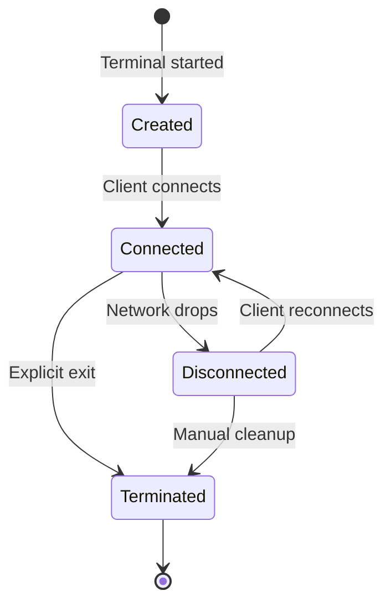

## What is a Persistent Session?

A persistent session is a terminal connection that survives network interruptions, computer sleep/wake cycles, and connection quality issues. Unlike traditional SSH, where a dropped connection kills your running processes, Undying Terminal keeps your session alive indefinitely.

## How It Works

### Session Lifecycle



### Component Roles

**Server (undying-terminal-server.exe)**
- Maintains session registry
- Routes traffic between clients and terminals
- Enforces encryption
- Handles authentication

**Terminal (undying-terminal-terminal.exe)**
- Manages the actual shell process (cmd.exe, PowerShell, etc.)
- Buffers output using ConPTY
- Survives client disconnections
- Persists until explicitly terminated

**Client (undying-terminal.exe)**
- User-facing interface
- Reconnects automatically on disconnect
- Can be closed and restarted without affecting session

## Session Recovery

### Sequence-Based Protocol

Every packet exchanged between client and terminal has a sequence number. When reconnecting:

1. Client sends last received sequence number
2. Server checks recovery buffer (64MB circular buffer)
3. Server replays all missed data
4. Session resumes exactly where it left off

**Example:**
```
Before disconnect:  Seq 1000
Network drops for 2 minutes
Reconnect:          Client says "I have up to seq 1000"
Server replies:     "Replaying seq 1001-1523"
Result:             No data loss, seamless recovery
```

### Buffer Capacity

| Activity Level | Data Rate | Time Until Buffer Full |
|---------------|-----------|------------------------|
| Idle session | ~100 B/s | ~7 days |
| Light typing | ~1 KB/s | ~17 hours |
| Moderate use | ~10 KB/s | ~1.7 hours |
| Heavy logging | ~100 KB/s | ~10 minutes |

<Warning>
If the recovery buffer fills up during a long disconnect, older data is discarded. The connection will still recover, but you'll see a gap in output.
</Warning>

## Persistence Guarantees

### What Survives

**Network disruptions:**
- WiFi disconnects
- Ethernet unplugs
- VPN reconnections
- IP address changes
- Router reboots

**System events:**
- Laptop sleep/wake
- Hibernate/resume
- Screen lock/unlock
- User switching

**Client crashes:**
- Client process killed
- Terminal emulator closed
- Client machine reboot (server keeps session)

### What Doesn't Survive

**Server process termination:**
- Server crash or restart kills all terminals
- Solution: Run server as Windows service

**Terminal process termination:**
- Manual kill of terminal process
- Server machine reboot
- Shell process exits cleanly

**Explicit session termination:**
- Running `exit` in the shell
- Sending `Ctrl+C` to terminal process
- Manual cleanup via server

## Session Identification

Every terminal session is identified by:

**Client ID (8-char hex)**
```
2f3a9c1b
```
- Randomly generated when terminal starts
- Used to identify which session to connect to
- Stable across client reconnections

**Passkey (optional, 32-char hex)**
```
a7f3e9d2c8b4f1e0a3c7b9d5f2e8c1a4
```
- Enables encryption (XSalsa20)
- Acts as authentication credential
- Required if server configured with `require_key`

## Comparison to Traditional SSH

| Feature | SSH | Undying Terminal |
|---------|-----|-----------------|
| Session persistence | No | Yes |
| Survives network drops | No | Yes |
| Output recovery | No | Yes (64MB buffer) |
| Automatic reconnection | No | Yes |
| Multiple simultaneous clients | No | Yes (same session) |
| Windows native | Via Cygwin/WSL | Native Windows |

## Session Management

### Listing Active Sessions

Server maintains a registry of all active terminals. Connect to server console to view:

```powershell
# Server logs show session creation:
[2024-02-06 10:23:15] Terminal 2f3a9c1b registered
[2024-02-06 10:23:45] Client connected to 2f3a9c1b
[2024-02-06 10:25:12] Client disconnected from 2f3a9c1b (network timeout)
[2024-02-06 10:25:18] Client reconnected to 2f3a9c1b
```

### Terminating Sessions

**Graceful exit:**
```powershell
# Inside the terminal session:
exit
```

**Force kill terminal:**
```powershell
# On server machine:
taskkill /F /IM undying-terminal-terminal.exe /FI "PID eq <PID>"
```

**Clean up orphaned sessions:**
Server automatically detects when terminal processes die and removes them from the registry.

## Advanced Session Features

### Multiple Clients to One Session

Multiple clients can connect to the same terminal session simultaneously:

```powershell
# Terminal 1:
./undying-terminal.exe --connect 192.168.1.10 2022 2f3a9c1b --key <KEY>

# Terminal 2 (same client ID):
./undying-terminal.exe --connect 192.168.1.10 2022 2f3a9c1b --key <KEY>
```

Both clients see the same output and can send input. Useful for:
- Screen sharing without screen sharing tools
- Pair programming
- Training/demonstrations

### Session Timeouts

Server does NOT implement idle timeouts by default. Sessions remain active until:
- Terminal process exits
- Server process exits
- Manual termination

To implement your own timeout, use shell-level mechanisms:
```powershell
# PowerShell auto-logout after 1 hour idle:
$Host.UI.RawUI.ReadKey("NoEcho,IncludeKeyDown") | Out-Null
```

## Best Practices

**For remote work:**
- Run server as Windows service (survives server reboots)
- Use encryption (`--key`) on untrusted networks
- Save connection commands as scripts
- Monitor server logs for security events

**For high-reliability needs:**
- Increase buffer size in server config (if dealing with high output volume)
- Set up monitoring/alerts if server goes down
- Use named sessions (via wrapper scripts) for easier reconnection

**For security:**
- Always use encryption on public networks
- Firewall server port (2022) to trusted IPs only
- Rotate passkeys periodically
- Enable server logging for audit trails

## Next Steps

- Learn about [Encryption](/concepts/encryption) for secure remote connections
- Understand the [Recovery Protocol](/concepts/recovery-protocol) in detail
- Set up [Port Forwarding](/guides/port-forwarding) for tunneling
