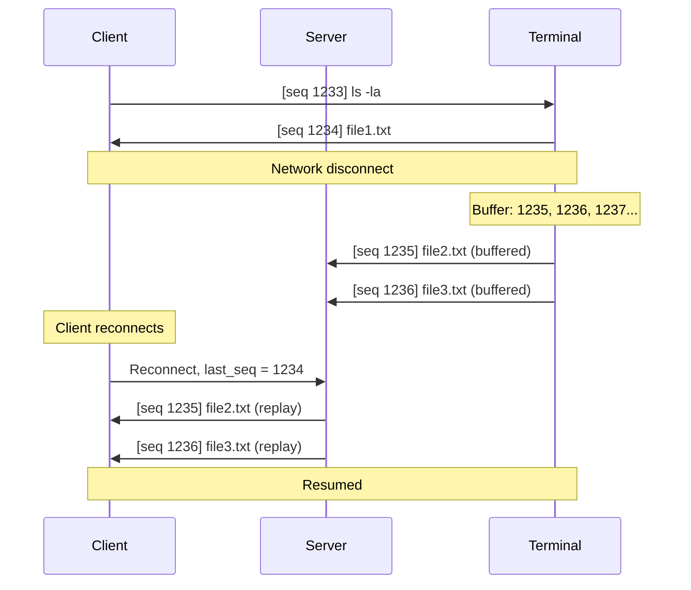

## Protocol Overview

Undying Terminal's recovery protocol ensures **zero data loss** during network disruptions using a sequence-based buffering system. Every byte of terminal output is numbered, buffered, and can be replayed on reconnection.

## Sequence Numbers

### What Are Sequence Numbers?

Each packet exchanged between client and terminal has a monotonically increasing sequence number:

```
Seq 0:    Server ready
Seq 1:    Client sends "ls -la"
Seq 2:    Terminal sends "total 48..."
Seq 3:    Terminal sends "drwxr-xr-x..."
Seq 4:    Terminal sends "-rw-r--r--..."
...
```

**Properties:**
- 64-bit unsigned integers (18 quintillion possible values)
- Never reset during session lifetime
- Increment by 1 for each message
- Separate counters for client→terminal and terminal→client

### Sequence Tracking

**Terminal maintains:**
- `last_sent_seq`: Last sequence number sent to client
- `last_acked_seq`: Last sequence number client confirmed receiving

**Client maintains:**
- `last_received_seq`: Last sequence number received from terminal
- `next_expected_seq`: Next sequence number expected

**On reconnection:**
```
Client: "I have everything up to seq 1234"
Terminal: "Replaying seq 1235-1456 from buffer"
```

## Recovery Buffer

### Buffer Architecture

The server maintains a **circular buffer** for each terminal session:

```
┌─────────────────────────────────────────┐
│   Recovery Buffer (64MB default)        │
│                                          │
│  ┌────┬────┬────┬────┬────┬────┬────┐  │
│  │1234│1235│1236│1237│1238│1239│1240│  │
│  └────┴────┴────┴────┴────┴────┴────┘  │
│    ^                              ^     │
│    oldest                      newest   │
│                                          │
│  When full: oldest messages discarded   │
└─────────────────────────────────────────┘
```

**Characteristics:**
- Fixed size (configurable in server config)
- Circular: Old data overwritten when full
- Per-session: Each terminal has its own buffer
- In-memory: Not persisted to disk

### Buffer Sizing

**Default: 64MB**

| Use Case | Recommended Size | Reasoning |
|----------|------------------|-----------|
| Interactive shells | 16-32MB | Minimal output, long retention |
| Development work | 64MB (default) | Moderate compiler output |
| CI/CD runners | 128-256MB | Heavy log output |
| Streaming logs | 512MB+ | Continuous high-volume data |

**How to configure:**

```ini
# ut.cfg (server config)
buffer_size_mb = 128
```

Restart server for changes to take effect.

### Buffer Capacity Examples

**64MB buffer can hold:**

```
10,000 lines of compiler output (~6.4KB per line)
1,000,000 simple shell commands (~64 bytes each)
~45 minutes of `tail -f` on a busy log file (~25KB/s)
~11 hours of idle shell prompts (~1.5KB/hour)
```

**Formula:**
```
Time to fill = Buffer size / Data rate

Examples:
- 64MB / 100 KB/s = 640 seconds = 10.7 minutes
- 64MB / 10 KB/s = 6400 seconds = 1.8 hours  
- 64MB / 1 KB/s = 64000 seconds = 17.8 hours
```

## Reconnection Flow

### Normal Reconnection

<Steps>
  <Step title="Client loses connection">
    Network drops, client closes, etc. Client notes `last_received_seq = 1234`.
  </Step>
  
  <Step title="Client reconnects">
    ```
    Client → Server: "Connect to session 2f3a9c1b, I have seq 1234"
    ```
  </Step>
  
  <Step title="Server checks buffer">
    ```
    Buffer contains: seq 1235-1456 (all data since disconnect)
    ```
  </Step>
  
  <Step title="Server replays missed data">
    ```
    Server → Client: [seq 1235][data]
    Server → Client: [seq 1236][data]
    ...
    Server → Client: [seq 1456][data]
    ```
  </Step>
  
  <Step title="Session resumes normally">
    Client is now caught up to seq 1456, continues from there.
  </Step>
</Steps>

**Visual timeline:**



### Buffer Overflow Scenario

**What happens when buffer fills during disconnect:**

<Steps>
  <Step title="Long disconnect begins">
    Client has seq 1000, buffer is empty.
  </Step>
  
  <Step title="Terminal produces data">
    Terminal generates output seq 1001-10000 (more than buffer can hold).
  </Step>
  
  <Step title="Buffer overflows">
    Buffer keeps seq 9936-10000 (newest 64MB), discards seq 1001-9935.
  </Step>
  
  <Step title="Client reconnects">
    ```
    Client: "I have seq 1000"
    Server: "I only have seq 9936-10000 in buffer"
    Server: "Sequence gap: 1000 → 9936"
    ```
  </Step>
  
  <Step title="Client receives gap notification">
    Client displays:
    ```
    [WARNING] Recovery gap detected: 8936 packets lost
    [Resuming from seq 9936]
    ```
  </Step>
</Steps>

**User experience:**
- Clear indication of data loss
- Session still functional
- New data appears normally
- Gap is a one-time warning, not ongoing issue

## Keepalive Mechanism

### Why Keepalives?

Network devices (routers, firewalls) close "idle" TCP connections:

| Device Type | Typical Timeout |
|-------------|-----------------|
| Home routers | 5-10 minutes |
| Corporate firewalls | 2-5 minutes |
| Public WiFi | 1-3 minutes |
| Mobile carriers | 30-90 seconds |

Without keepalives, an idle terminal would disconnect within minutes.

### How It Works

**Default: 5-second keepalive interval**

```
Client ← Server: [keepalive ping]  (every 5 seconds if no other traffic)
Client → Server: [keepalive pong]  (immediate response)
```

**Keepalive logic:**

```cpp
// Simplified pseudocode
if (time_since_last_packet > 5_seconds) {
    send_keepalive();
}

if (time_since_last_keepalive_response > 15_seconds) {
    mark_connection_dead();
    trigger_reconnect();
}
```

### Configuration

**Server-side (ut.cfg):**

```ini
# Keepalive interval in seconds
keepalive_interval = 5

# Timeout multiplier (3 × interval = 15 seconds default)
keepalive_timeout_multiplier = 3
```

**Client-side:**
- Clients automatically respond to keepalives
- No configuration needed
- Keepalives are transparent to user

### Keepalive Overhead

**Network usage:**
```
Keepalive size: ~64 bytes per ping/pong = 128 bytes total
Frequency: Every 5 seconds
Bandwidth: 128 bytes / 5 sec = 25.6 bytes/sec = 0.2 Kbps

For 1000 idle sessions: 0.2 Mbps total
```

**CPU usage:**
- Negligible (less than 0.1% per session)
- Simple timestamp check and small packet send

## Data Integrity

### Checksums

Every packet includes a CRC32 checksum:

```
[Sequence][Length][Data][CRC32]
  8 bytes  4 bytes  var   4 bytes
```

**On receive:**
1. Calculate CRC32 of received data
2. Compare with packet's CRC32
3. If mismatch: Discard packet, request retransmission

**Corruption detection:**
- Bit flips during transmission
- Memory corruption
- Network equipment errors

### Out-of-Order Delivery

**TCP guarantees in-order delivery**, so Undying Terminal assumes packets arrive in sequence order. However, on reconnection:

**Scenario: Client reconnects during active transmission**

```
Buffer state: [1234][1235][1236][1237]
Client requests: "Replay from 1234"
Server sends: 1235, 1236, 1237
Simultaneously, new data arrives: 1238, 1239

Client receives: 1235, 1238, 1236, 1237, 1239 (out of order!)
```

**Solution: Client-side reordering buffer**

Client maintains a small reorder window (100 packets):
1. Receive packet with seq 1238
2. Expected seq 1236, so buffer 1238
3. Receive 1236, deliver to terminal
4. Receive 1237, deliver to terminal  
5. Check buffer: 1238 is now next, deliver it

### Duplicate Suppression

**Scenario: Retransmission due to network glitch**

```
Server sends: [seq 1234][data]
Network delays: packet not acknowledged
Server retransmits: [seq 1234][data] (duplicate)
Client receives both
```

**Solution: Sequence number tracking**

```cpp
if (received_seq <= last_received_seq) {
    // Duplicate or out-of-order old packet
    discard();
} else {
    process_packet();
    last_received_seq = received_seq;
}
```

## Protocol Efficiency

### Overhead Analysis

**Per-packet overhead:**

| Component | Size | Purpose |
|-----------|------|---------|
| Sequence number | 8 bytes | Recovery tracking |
| Length | 4 bytes | Packet framing |
| CRC32 | 4 bytes | Integrity check |
| **Total** | **16 bytes** | Per packet |

**Efficiency for different data sizes:**

| Payload | Overhead | Efficiency |
|---------|----------|------------|
| 10 bytes (keystroke) | 16 bytes | 38% |
| 100 bytes (line) | 16 bytes | 86% |
| 1KB (screen) | 16 bytes | 98.4% |
| 64KB (max) | 16 bytes | 99.975% |

**Takeaway:** Overhead is negligible for normal terminal use (hundreds of bytes per packet).

### Compression

**Current status:** Not implemented

**Potential benefit:**

| Content Type | Typical Compression Ratio |
|--------------|---------------------------|
| Text output | 2-3× smaller |
| Log files | 3-5× smaller |
| Binary data | 1.1× (minimal) |
| Already compressed | 1× (no benefit) |

**Trade-off:**
- CPU cost: ~5-10% overhead for compression/decompression
- Latency cost: +1-2ms for compression
- Bandwidth savings: 50-70% for text-heavy workloads

Could be added as optional feature for low-bandwidth scenarios.

## Advanced Scenarios

### Session Cloning

**Can you clone a buffer to a new client?**

Currently not supported, but architecturally possible:

```
Client A: Connected to session 2f3a9c1b, seq 5000
Client B: Wants to "clone" session, starting from seq 4500

Implementation:
- Server replays seq 4500-5000 to Client B
- Both clients receive new data (seq 5001+) simultaneously
```

**Use cases:**
- Training: Instructor shares live session with students
- Debugging: Observer connects to user's session mid-problem
- Monitoring: Audit trail of session activity

### Multi-Path Redundancy

**Can you connect over multiple networks simultaneously?**

Not currently supported, but theoretically possible:

```
Client connects via:
- WiFi (primary)
- Ethernet (backup)
- LTE (tertiary)

If WiFi drops:
- Seamlessly switch to Ethernet
- No reconnection needed
- Zero data loss
```

Requires protocol extension for path management.

## Comparison to Other Recovery Protocols

| Protocol | Approach | Data Loss | Complexity |
|----------|----------|-----------|------------|
| **Undying Terminal** | Sequence + buffer | Zero (if buffer holds) | Low |
| Mosh | Speculative execution | Zero (via prediction) | Medium |
| EternalTerminal | SSH tunneling | Zero (via SSH) | High |
| Screen/tmux | Session detach | Zero (local only) | Low |
| SSH + autossh | Reconnection only | High (no buffering) | Medium |

**Key difference:**
- Mosh: Predicts what you'll type (works offline)
- Undying Terminal: Buffers what actually happened (perfect replay)
- SSH: Gives up on disconnect (no recovery)

## Next Steps

- Understand [Persistent Sessions](/concepts/persistent-sessions) for context
- Learn about [Encryption](/concepts/encryption) for securing recovery data
- Review [Architecture Overview](/architecture/overview) for system design
