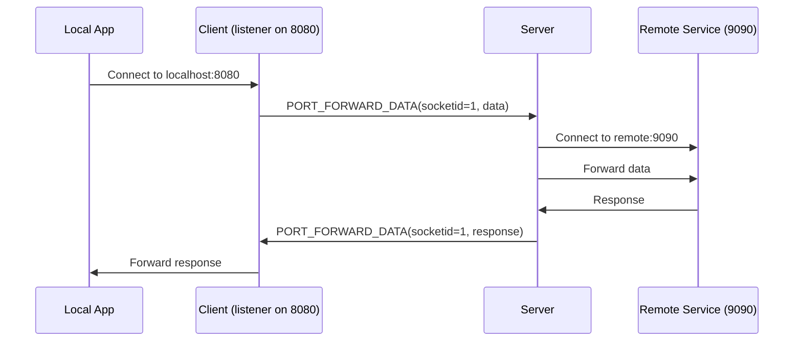
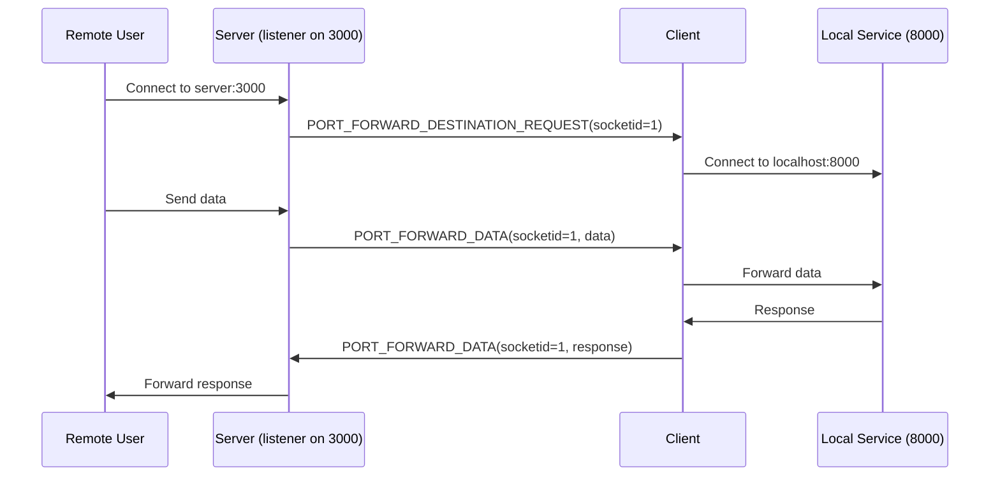

## Overview

Undying Terminal supports **two types of port forwarding** to tunnel TCP traffic through your persistent session:

<CardGroup cols={2}>
  <Card title="Forward Tunnels (-t)" icon="arrow-right">
    Client opens local port → forwards to remote destination
    
    **Use case**: Access remote services locally
  </Card>
  
  <Card title="Reverse Tunnels (-r)" icon="arrow-left">
    Server opens port → client connects to local destination
    
    **Use case**: Expose local services remotely
  </Card>
</CardGroup>

Both tunnel types **survive disconnects** and automatically reconnect, making them ideal for unstable networks.

## Forward Tunnels

### Basic Syntax

```powershell
./undying-terminal.exe `
  --connect <HOST> <PORT> <CLIENT_ID> `
  --key <PASSKEY> `
  -t <LOCAL_PORT>:<REMOTE_HOST>:<REMOTE_PORT>
```

### Examples

<CodeGroup>
```powershell Simple Forward
# Forward local 8080 → remote 9090
./undying-terminal.exe `
  --connect 192.168.1.100 2022 abc123 `
  --key mypasskey `
  -t 8080:9090

# Access via: http://localhost:8080 → remote:9090
```

```powershell Explicit Bind
# Forward local 8080 → specific remote host:port
./undying-terminal.exe `
  --connect 192.168.1.100 2022 abc123 `
  --key mypasskey `
  -t 8080:database.internal:5432

# Access via: localhost:8080 → database.internal:5432
```

```powershell Port Range
# Forward multiple ports (8080-8085 → 9090-9095)
./undying-terminal.exe `
  --connect 192.168.1.100 2022 abc123 `
  --key mypasskey `
  -t 8080-8085:9090-9095

# Creates 6 tunnels:
# 8080 → 9090, 8081 → 9091, ..., 8085 → 9095
```

```powershell Custom Bind Address
# Bind to specific interface (not just localhost)
./undying-terminal.exe `
  --connect 192.168.1.100 2022 abc123 `
  --key mypasskey `
  -t 192.168.1.50:8080:remote:9090

# Access via: 192.168.1.50:8080 → remote:9090
```
</CodeGroup>

### How Forward Tunnels Work



<Steps>
  <Step title="Client Opens Listener">
    Client starts TCP listener on specified local port (e.g., 8080)
  </Step>
  
  <Step title="Local Connection Established">
    Local application connects to `localhost:8080`
  </Step>
  
  <Step title="Tunnel Request Sent">
    Client sends `PORT_FORWARD_DESTINATION_REQUEST` to server with:
    - Source: `localhost:8080`
    - Destination: `remote:9090`
    - Socket ID: unique identifier
  </Step>
  
  <Step title="Server Connects to Destination">
    Server establishes TCP connection to `remote:9090`
  </Step>
  
  <Step title="Bidirectional Relay">
    All traffic flows through the session:
    - Local → Client → Server → Remote
    - Remote → Server → Client → Local
  </Step>
</Steps>

### Use Cases

<AccordionGroup>
  <Accordion title="Database Access" icon="database">
    Forward remote database to local port:
    
    ```powershell
    # PostgreSQL
    -t 5432:db.internal:5432
    
    # MySQL
    -t 3306:mysql.internal:3306
    
    # Redis
    -t 6379:redis.internal:6379
    ```
    
    Connect with local tools:
    ```powershell
    psql -h localhost -p 5432 -U user
    ```
  </Accordion>
  
  <Accordion title="Web Development" icon="code">
    Access remote development servers:
    
    ```powershell
    # Forward remote webpack dev server
    -t 8080:localhost:8080
    
    # Forward remote API server
    -t 3000:api.dev:3000
    ```
    
    Access via browser: `http://localhost:8080`
  </Accordion>
  
  <Accordion title="Internal Services" icon="network-wired">
    Access services behind firewall:
    
    ```powershell
    # Kubernetes dashboard
    -t 8001:k8s-master:8001
    
    # Grafana
    -t 3000:monitoring.internal:3000
    
    # Jenkins
    -t 8080:ci.internal:8080
    ```
  </Accordion>
</AccordionGroup>

## Reverse Tunnels

### Basic Syntax

```powershell
./undying-terminal.exe `
  --connect <HOST> <PORT> <CLIENT_ID> `
  --key <PASSKEY> `
  -r <REMOTE_PORT>:<LOCAL_HOST>:<LOCAL_PORT>
```

### Examples

<CodeGroup>
```powershell Simple Reverse
# Server listens on 3000, forwards to client's localhost:8000
./undying-terminal.exe `
  --connect 192.168.1.100 2022 abc123 `
  --key mypasskey `
  -r 3000:localhost:8000

# Remote access via: server:3000 → client's localhost:8000
```

```powershell Expose Local Service
# Expose local web server to remote network
./undying-terminal.exe `
  --connect remote-server.com 2022 abc123 `
  --key mypasskey `
  -r 8080:localhost:3000

# Remote users access: http://remote-server.com:8080
```

```powershell Multiple Reverse Tunnels
# Expose multiple services
./undying-terminal.exe `
  --connect remote-server.com 2022 abc123 `
  --key mypasskey `
  -r 8080:localhost:3000 `
  -r 9090:localhost:5000 `
  -r 5432:localhost:5432
```
</CodeGroup>

### How Reverse Tunnels Work



<Steps>
  <Step title="Server Opens Listener">
    Server starts TCP listener on specified remote port (e.g., 3000)
  </Step>
  
  <Step title="Remote Connection Established">
    Remote user connects to `server:3000`
  </Step>
  
  <Step title="Destination Request Sent">
    Server sends `PORT_FORWARD_DESTINATION_REQUEST` to client with socket ID
  </Step>
  
  <Step title="Client Connects Locally">
    Client establishes connection to specified local destination (e.g., `localhost:8000`)
  </Step>
  
  <Step title="Bidirectional Relay">
    Traffic flows:
    - Remote → Server → Client → Local
    - Local → Client → Server → Remote
  </Step>
</Steps>

### Use Cases

<AccordionGroup>
  <Accordion title="Development Webhooks" icon="webhook">
    Expose local dev server for webhooks (GitHub, Stripe, etc.):
    
    ```powershell
    # Expose local:3000 to internet via remote server
    -r 80:localhost:3000
    ```
    
    Configure webhook URL: `http://remote-server.com:80/webhook`
  </Accordion>
  
  <Accordion title="Demo/Staging" icon="presentation-screen">
    Share local development with team:
    
    ```powershell
    # Expose local React app
    -r 8080:localhost:3000
    ```
    
    Team access: `http://remote-server.com:8080`
  </Accordion>
  
  <Accordion title="Remote Desktop / VNC" icon="desktop">
    Access local machine from remote network:
    
    ```powershell
    # RDP
    -r 3389:localhost:3389
    
    # VNC
    -r 5900:localhost:5900
    
    # SSH to local machine
    -r 2222:localhost:22
    ```
  </Accordion>
</AccordionGroup>

## Multiple Tunnels

Combine forward and reverse tunnels:

```powershell
./undying-terminal.exe `
  --connect server.com 2022 abc123 `
  --key mypasskey `
  -t 5432:db.internal:5432 `          # Forward: local DB access
  -t 6379:redis.internal:6379 `       # Forward: local Redis access
  -r 8080:localhost:3000 `             # Reverse: expose local web server
  -r 9090:localhost:5000               # Reverse: expose local API
```

## Tunnel Syntax Reference

### Format Options

| Syntax | Description | Example |
|--------|-------------|---------|
| `LOCAL:REMOTE` | Simple: local port → remote port | `-t 8080:9090` |
| `LOCAL:HOST:REMOTE` | Explicit: local port → remote host:port | `-t 8080:db:5432` |
| `BIND:LOCAL:HOST:REMOTE` | Full: bind IP, local port → remote host:port | `-t 0.0.0.0:8080:db:5432` |
| `START-END:START-END` | Range: multiple ports | `-t 8080-8085:9090-9095` |

### Bind Addresses

| Address | Behavior |
|---------|----------|
| `localhost` (default) | Only accessible from local machine |
| `0.0.0.0` | Accessible from any interface |
| `192.168.1.x` | Accessible from specific interface |
| `127.0.0.1` | Explicit localhost |

<Warning>
**Security**: Binding to `0.0.0.0` exposes the tunnel to your network. Use with caution!
</Warning>

## Tunnel Persistence

Tunnels **survive disconnects**:

<Steps>
  <Step title="Initial Connection">
    Client connects, tunnels established
  </Step>
  
  <Step title="Network Interruption">
    Network drops, client disconnects
  </Step>
  
  <Step title="Automatic Reconnect">
    Client reconnects automatically
  </Step>
  
  <Step title="Tunnels Restored">
    All tunnels re-established transparently
  </Step>
</Steps>

<Check>
Active connections through tunnels are **not preserved** during disconnect. However, new connections work immediately after reconnect.
</Check>

## Environment Variable Forwarding

Forward environment variables through tunnels:

```powershell
# Forward based on env var
$env:MY_SERVICE_PORT = "8080:remote-service:9090"
./undying-terminal.exe ... -t $env:MY_SERVICE_PORT
```

Useful for scripting and automation.

## Troubleshooting

<AccordionGroup>
  <Accordion title="Tunnel not working - connection refused">
    **Symptoms**: Local/remote service unreachable
    
    **Diagnosis**:
    1. Verify service is running:
       ```powershell
       # On destination machine
       netstat -ano | findstr :9090
       ```
    2. Check firewall rules
    3. Verify bind address (localhost vs 0.0.0.0)
    
    **Solution**: Ensure destination service is accessible from server
  </Accordion>
  
  <Accordion title="Port already in use">
    **Error**: `bind: address already in use`
    
    **Diagnosis**:
    ```powershell
    netstat -ano | findstr :8080
    ```
    
    **Solution**: 
    - Choose different local port
    - Kill process using the port
    - Use specific bind address (not 0.0.0.0)
  </Accordion>
  
  <Accordion title="Slow tunnel performance">
    **Symptoms**: High latency, slow transfers
    
    **Causes**:
    - Network bandwidth limitation
    - Multiple packet hops
    - Large recovery buffer replay
    
    **Solutions**:
    - Use direct network path when possible
    - Reduce keepalive frequency
    - Check network quality (ping, traceroute)
  </Accordion>
  
  <Accordion title="Tunnel breaks after reconnect">
    **Expected Behavior**: Active connections drop, new connections work
    
    **Explanation**: TCP connections can't survive both endpoints changing. Undying Terminal restores the tunnel infrastructure, but application-level connections must be re-established.
    
    **Workaround**: Applications should implement reconnect logic
  </Accordion>
</AccordionGroup>

## Best Practices

<CardGroup cols={2}>
  <Card title="Security" icon="shield">
    - Use `localhost` bind when possible
    - Enable encryption for internet-facing tunnels
    - Restrict server firewall rules
    - Use strong passkeys
  </Card>
  
  <Card title="Performance" icon="gauge-high">
    - Minimize tunnel hops (use direct paths)
    - Use port ranges for efficiency
    - Monitor bandwidth usage
    - Test latency impact
  </Card>
  
  <Card title="Reliability" icon="circle-check">
    - Design for reconnect (don't rely on persistent connections)
    - Use health checks in applications
    - Log tunnel status
    - Monitor connection stability
  </Card>
  
  <Card title="Organization" icon="list">
    - Document tunnel mappings
    - Use consistent port conventions
    - Group related tunnels
    - Version tunnel configurations
  </Card>
</CardGroup>

## Next Steps

<CardGroup cols={2}>
  <Card
    title="Jumphost Guide"
    icon="server"
    href="/guides/jumphost"
  >
    Connect through intermediate servers
  </Card>
  
  <Card
    title="SSH Bootstrap"
    icon="terminal"
    href="/guides/ssh-bootstrap"
  >
    Start remote sessions over SSH
  </Card>
  
  <Card
    title="Client CLI Reference"
    icon="rectangle-terminal"
    href="/api-reference/client-cli"
  >
    Full CLI options
  </Card>
  
  <Card
    title="Architecture"
    icon="diagram-project"
    href="/architecture/overview"
  >
    How tunnels work internally
  </Card>
</CardGroup>
