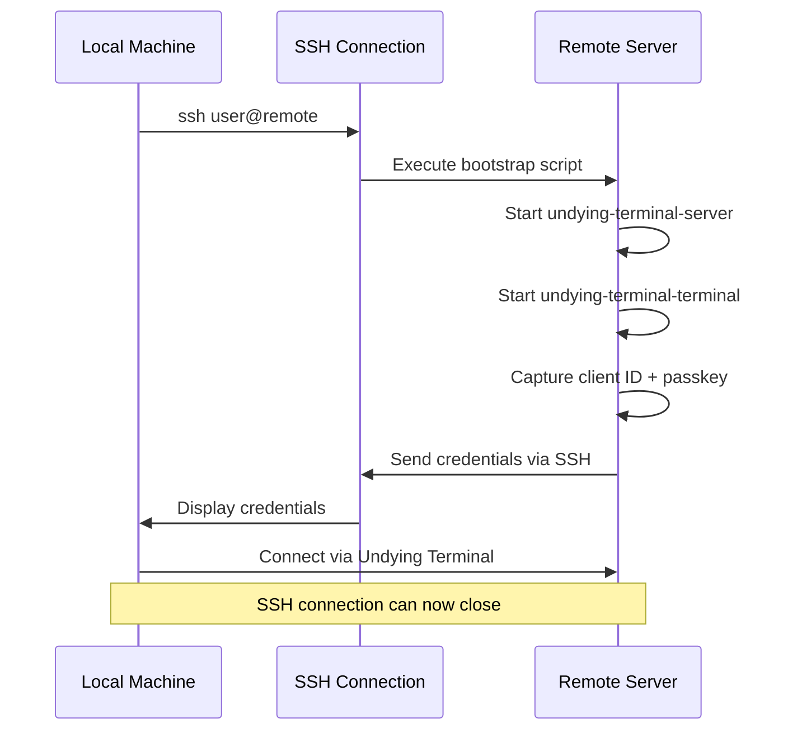

## What is SSH Bootstrap?

SSH Bootstrap allows you to use an existing SSH connection to securely set up an Undying Terminal session. This solves the chicken-and-egg problem of remote deployment:

**Without SSH Bootstrap:**
1. Manually copy binaries to remote machine
2. Manually start server
3. Manually start terminal and capture client ID/passkey
4. Manually configure firewall
5. Hope everything works

**With SSH Bootstrap:**
```powershell
# Single command does everything:
ssh user@remote "undying-terminal-bootstrap.exe"
```

## How It Works



## Basic Usage

### Prerequisites

<CardGroup cols={2}>
  <Card title="Local Machine">
    - Undying Terminal client installed
    - SSH client (OpenSSH, PuTTY)
    - Network access to remote machine
  </Card>
  
  <Card title="Remote Machine">
    - Undying Terminal binaries (server + terminal)
    - Windows 10 Build 17763+
    - Port 2022 accessible (can be firewalled initially)
  </Card>
</CardGroup>

### Step-by-Step Bootstrap

<Steps>
  <Step title="Copy binaries to remote machine">
    ```powershell
    # Using SCP:
    scp undying-terminal-*.exe user@remote:/path/to/destination/
    
    # Or use RDP/file share/USB drive
    ```
  </Step>
  
  <Step title="SSH into remote machine">
    ```powershell
    ssh user@remote-server.example.com
    ```
  </Step>
  
  <Step title="Run server in background">
    ```powershell
    # PowerShell (on remote):
    Start-Process -FilePath "./undying-terminal-server.exe" `
                  -WindowStyle Hidden `
                  -PassThru
    
    # Or use Windows service (recommended):
    ./undying-terminal-server.exe --install-service
    net start UndyingTerminalServer
    ```
  </Step>
  
  <Step title="Start terminal and capture credentials">
    ```powershell
    # On remote machine via SSH:
    $Passkey = -join ((1..16) | ForEach-Object { "{0:x2}" -f (Get-Random -Max 256) })
    echo $Passkey | ./undying-terminal-terminal.exe
    
    # Terminal will output:
    # Client ID: 2f3a9c1b
    # Passkey: a7f3e9d2c8b4f1e0a3c7b9d5f2e8c1a4
    ```
    
    Save these values locally.
  </Step>
  
  <Step title="Configure firewall (if needed)">
    ```powershell
    # Allow port 2022 from your IP:
    netsh advfirewall firewall add rule `
      name="Undying Terminal" `
      dir=in action=allow protocol=TCP localport=2022 `
      remoteip=YOUR_IP_HERE
    ```
  </Step>
  
  <Step title="Connect from local machine">
    ```powershell
    # Exit SSH session (Ctrl+D)
    exit
    
    # Now connect via Undying Terminal:
    ./undying-terminal.exe `
      --connect remote-server.example.com 2022 2f3a9c1b `
      --key a7f3e9d2c8b4f1e0a3c7b9d5f2e8c1a4 `
      --noexit
    ```
  </Step>
</Steps>

### Automated Bootstrap Script

**PowerShell script for automated setup:**

```powershell
# bootstrap-remote.ps1
param(
    [Parameter(Mandatory=$true)]
    [string]$RemoteHost,
    
    [Parameter(Mandatory=$true)]
    [string]$RemoteUser,
    
    [string]$RemotePath = "C:\UndyingTerminal"
)

# 1. Copy binaries
Write-Host "Copying binaries to $RemoteHost..."
scp undying-terminal-*.exe "${RemoteUser}@${RemoteHost}:${RemotePath}/"

# 2. Generate passkey locally
$Passkey = -join ((1..16) | ForEach-Object { "{0:x2}" -f (Get-Random -Max 256) })

# 3. SSH and run setup
Write-Host "Setting up Undying Terminal on $RemoteHost..."
$SetupScript = @"
cd $RemotePath

# Start server
Start-Process -FilePath ./undying-terminal-server.exe -WindowStyle Hidden

Start-Sleep -Seconds 2

# Start terminal with passkey
`$Output = echo '$Passkey' | ./undying-terminal-terminal.exe 2>&1
`$ClientID = (`$Output | Select-String 'Client ID: (.*)').Matches.Groups[1].Value

Write-Output "CLIENT_ID:`$ClientID"
Write-Output "PASSKEY:$Passkey"
"@

$Result = ssh "${RemoteUser}@${RemoteHost}" "powershell -Command `"$SetupScript`""

# 4. Parse output
$ClientID = ($Result | Select-String 'CLIENT_ID:(.*)').Matches.Groups[1].Value
$ActualKey = ($Result | Select-String 'PASSKEY:(.*)').Matches.Groups[1].Value

# 5. Save connection script
$ConnectScript = @"
./undying-terminal.exe ``
  --connect $RemoteHost 2022 $ClientID ``
  --key $ActualKey ``
  --noexit
"@

Set-Content -Path "connect-$RemoteHost.ps1" -Value $ConnectScript

Write-Host ""
Write-Host "Bootstrap complete!" -ForegroundColor Green
Write-Host "Client ID: $ClientID"
Write-Host "Passkey: $ActualKey"
Write-Host ""
Write-Host "Connect with: ./connect-$RemoteHost.ps1"
```

**Usage:**
```powershell
./bootstrap-remote.ps1 -RemoteHost 192.168.1.10 -RemoteUser admin
```

## Advanced Bootstrap Patterns

### Bootstrap via Jump Host

When the target server is only accessible via a jump host:

```powershell
# Setup SSH tunnel through jump host:
ssh -L 2022:target-server:2022 user@jump-host

# In another terminal, bootstrap the target:
ssh -J user@jump-host user@target-server "bootstrap-script.ps1"

# Connect via tunnel:
./undying-terminal.exe --connect 127.0.0.1 2022 <CLIENT_ID> --key <KEY>
```

**See also:** [Jumphost Guide](/guides/jumphost) for detailed tunneling setups.

### Bootstrap with Custom Server Config

**Remote bootstrap script with configuration:**

```powershell
# On remote machine (via SSH):
# 1. Create server config
$Config = @"
listen_port = 2022
require_key = true
buffer_size_mb = 128
keepalive_interval = 5
log_file = C:\UndyingTerminal\logs\server.log
"@

Set-Content -Path "C:\ProgramData\UndyingTerminal\ut.cfg" -Value $Config

# 2. Start server with config
./undying-terminal-server.exe --config C:\ProgramData\UndyingTerminal\ut.cfg

# 3. Start terminal
echo $Passkey | ./undying-terminal-terminal.exe
```

### Bootstrap Multiple Sessions

**Set up multiple independent sessions:**

```powershell
# Session 1: Development environment
echo $DevKey | ./undying-terminal-terminal.exe
# Output: Client ID: 2f3a9c1b

# Session 2: Production monitoring  
echo $ProdKey | ./undying-terminal-terminal.exe
# Output: Client ID: 8e4f7a2d

# Session 3: Database admin
echo $DBKey | ./undying-terminal-terminal.exe
# Output: Client ID: c5d9e1f3
```

Each session is isolated with its own passkey and buffer.

## Security Considerations

### SSH Key-Based Authentication

**Always use SSH keys instead of passwords:**

```powershell
# Generate SSH key locally:
ssh-keygen -t ed25519 -C "undying-terminal-bootstrap"

# Copy public key to remote:
ssh-copy-id user@remote-server

# Now bootstrap without password:
ssh user@remote-server "bootstrap-script.ps1"
```

### Passkey Security

**Protecting the passkey during bootstrap:**

**Bad (passkey in command history):**
```powershell
ssh user@remote "echo 'a7f3e9d2...' | ./undying-terminal-terminal.exe"
```

**Good (generate on remote):**
```powershell
ssh user@remote "
  \$Key = [System.Convert]::ToBase64String((1..16 | %{Get-Random -Max 256}))
  echo \$Key | ./undying-terminal-terminal.exe
"
```

**Best (use secrets manager):**
```powershell
# Store in Azure Key Vault, AWS Secrets Manager, etc.
$Passkey = az keyvault secret show --name undying-passkey --vault-name mykeyvault --query value -o tsv
ssh user@remote "echo '$Passkey' | ./undying-terminal-terminal.exe"
```

### Firewall Configuration

**Least-privilege firewall rules:**

```powershell
# Allow only from your static IP:
netsh advfirewall firewall add rule `
  name="Undying Terminal - My Office" `
  dir=in action=allow protocol=TCP localport=2022 `
  remoteip=203.0.113.42

# Or allow from VPN subnet:
netsh advfirewall firewall add rule `
  name="Undying Terminal - VPN" `
  dir=in action=allow protocol=TCP localport=2022 `
  remoteip=10.8.0.0/24
```

**Do NOT allow 0.0.0.0/0 (all IPs) unless absolutely necessary.**

### Audit Logging

**Enable server logging during bootstrap:**

```powershell
# In ut.cfg:
log_file = C:\UndyingTerminal\logs\server.log
log_level = INFO

# Monitor for unauthorized access:
Get-Content C:\UndyingTerminal\logs\server.log -Wait | 
  Select-String "authentication failed"
```

## Troubleshooting Bootstrap

### Common Issues

<AccordionGroup>
  <Accordion title="Server won't start after bootstrap">
    **Symptoms:** Server process exits immediately after starting via SSH.
    
    **Causes:**
    - Port 2022 already in use
    - Insufficient permissions
    - Antivirus blocking execution
    
    **Solutions:**
    ```powershell
    # Check port availability:
    netstat -ano | findstr :2022
    
    # Run as administrator:
    ssh user@remote "Start-Process -Verb RunAs -FilePath ./undying-terminal-server.exe"
    
    # Add antivirus exception:
    Add-MpPreference -ExclusionPath "C:\UndyingTerminal"
    ```
  </Accordion>
  
  <Accordion title="Can't capture client ID/passkey from SSH output">
    **Symptoms:** Terminal output is garbled or not visible in SSH session.
    
    **Solutions:**
    ```powershell
    # Redirect output to file:
    ssh user@remote "
      echo \$Passkey | ./undying-terminal-terminal.exe > output.txt 2>&1
      cat output.txt
    "
    
    # Or use explicit output parsing:
    ssh user@remote "
      \$Output = echo \$Passkey | ./undying-terminal-terminal.exe 2>&1
      \$ClientID = (\$Output | Select-String 'Client ID: (.*)').Matches.Groups[1].Value
      Write-Output \$ClientID
    "
    ```
  </Accordion>
  
  <Accordion title="Firewall blocks connection after bootstrap">
    **Symptoms:** Server runs, credentials captured, but client connection times out.
    
    **Solutions:**
    ```powershell
    # Test connectivity:
    Test-NetConnection -ComputerName remote-server -Port 2022
    
    # Temporarily disable firewall (testing only):
    ssh user@remote "netsh advfirewall set allprofiles state off"
    
    # Add firewall rule via SSH:
    ssh user@remote "
      netsh advfirewall firewall add rule name='UT' dir=in action=allow protocol=TCP localport=2022
    "
    ```
  </Accordion>
  
  <Accordion title="Server stops when SSH session closes">
    **Symptoms:** Server and terminal die when you exit SSH.
    
    **Cause:** Processes inherit SSH session and get killed with it.
    
    **Solutions:**
    ```powershell
    # Option 1: Use nohup equivalent (PowerShell job):
    ssh user@remote "
      Start-Job -ScriptBlock { ./undying-terminal-server.exe }
    "
    
    # Option 2: Install as Windows service:
    ssh user@remote "
      ./undying-terminal-server.exe --install-service
      net start UndyingTerminalServer
    "
    
    # Option 3: Use screen/tmux on remote:
    ssh user@remote "
      screen -dmS ut-server ./undying-terminal-server.exe
    "
    ```
  </Accordion>
</AccordionGroup>

### Debugging Bootstrap Process

**Verbose bootstrap script:**

```powershell
# verbose-bootstrap.ps1
ssh user@remote "
  Write-Host 'Step 1: Checking binaries...'
  Get-ChildItem ./undying-terminal-*.exe
  
  Write-Host 'Step 2: Starting server...'
  Start-Process -FilePath ./undying-terminal-server.exe -WindowStyle Hidden
  Start-Sleep -Seconds 5
  
  Write-Host 'Step 3: Checking server process...'
  Get-Process undying-terminal-server -ErrorAction SilentlyContinue
  
  Write-Host 'Step 4: Checking port...'
  netstat -ano | findstr :2022
  
  Write-Host 'Step 5: Starting terminal...'
  \$Passkey = 'test1234567890ab'
  echo \$Passkey | ./undying-terminal-terminal.exe
  
  Write-Host 'Bootstrap complete'
"
```

## Best Practices

<CardGroup cols={2}>
  <Card title="DO" icon="check">
    - Use SSH keys, not passwords
    - Generate passkeys on remote machine
    - Save credentials in password manager
    - Install server as Windows service
    - Configure firewall during bootstrap
    - Test connection before closing SSH
  </Card>
  
  <Card title="DON'T" icon="xmark">
    - Put passkeys in version control
    - Allow 0.0.0.0/0 firewall rules
    - Leave server running as SSH child process
    - Forget to save client ID/passkey
    - Skip testing the connection
    - Use same passkey across environments
  </Card>
</CardGroup>

## Alternative Bootstrap Methods

### Bootstrap via WinRM

If SSH is not available but WinRM is:

```powershell
# Enable WinRM (one-time):
Enable-PSRemoting -Force

# Bootstrap via WinRM:
Invoke-Command -ComputerName remote-server -ScriptBlock {
    cd C:\UndyingTerminal
    Start-Process -FilePath ./undying-terminal-server.exe -WindowStyle Hidden
    
    $Passkey = -join ((1..16) | ForEach-Object { "{0:x2}" -f (Get-Random -Max 256) })
    $Output = echo $Passkey | ./undying-terminal-terminal.exe 2>&1
    
    Write-Output $Output
}
```

### Bootstrap via RDP

Manual bootstrap over Remote Desktop:

<Steps>
  <Step title="RDP to remote machine">
    ```powershell
    mstsc /v:remote-server.example.com
    ```
  </Step>
  
  <Step title="Run binaries manually">
    Open PowerShell as Administrator, start server and terminal as described in [Basic Usage](#basic-usage).
  </Step>
  
  <Step title="Save credentials locally">
    Copy client ID and passkey to your local machine.
  </Step>
  
  <Step title="Disconnect RDP">
    Sessions will persist after RDP disconnects.
  </Step>
</Steps>

### Bootstrap via Configuration Management

**Ansible playbook:**

```yaml
# bootstrap-undying-terminal.yml
- hosts: windows_servers
  tasks:
    - name: Copy binaries
      win_copy:
        src: "{{ item }}"
        dest: C:\UndyingTerminal\
      loop:
        - undying-terminal-server.exe
        - undying-terminal-terminal.exe
        - undying-terminal.exe
    
    - name: Install as service
      win_command: C:\UndyingTerminal\undying-terminal-server.exe --install-service
      
    - name: Start service
      win_service:
        name: UndyingTerminalServer
        state: started
    
    - name: Start terminal session
      win_shell: |
        $Passkey = -join ((1..16) | ForEach-Object { "{0:x2}" -f (Get-Random -Max 256) })
        echo $Passkey | C:\UndyingTerminal\undying-terminal-terminal.exe
      register: terminal_output
    
    - name: Display credentials
      debug:
        var: terminal_output.stdout
```

## Tmux Integration (v1.1.0+)

Automatically wrap remote sessions in tmux for enhanced persistence:

### Basic Tmux Usage

```powershell
# Attach to default tmux session (creates if doesn't exist)
./undying-terminal.exe --ssh user@remote-server.com -l username --tmux

# Attach to named tmux session
./undying-terminal.exe --ssh user@remote-server.com -l username --tmux --tmux-session dev

# Full example with all options
./undying-terminal.exe `
  --ssh user@remote-server.com `
  -l username `
  --tmux `
  --tmux-session myproject `
  --predictive-echo
```

### Why Use Tmux?

**Tmux + Undying Terminal = Maximum Persistence**

| Feature | Undying Terminal Alone | Tmux + Undying Terminal |
|---------|----------------------|------------------------|
| Network drops | Session survives | Session survives |
| Client disconnect | Session survives | Session survives |
| Terminal crashes | Session survives | Session survives |
| Shell exits | Session ends | Tmux preserves session |
| Multiple windows | One terminal | Multiple tmux windows |
| Scrollback | Client-side only | Server-side preserved |

### Tmux Workflow Examples

**Development Session:**

```powershell
# Connect with tmux
./undying-terminal.exe --ssh dev-server -l dev --tmux --tmux-session coding

# Inside tmux:
# Ctrl+b c    - Create new window
# Ctrl+b n    - Next window  
# Ctrl+b p    - Previous window
# Ctrl+b d    - Detach (leave session running)
```

**Persistent Build Process:**

```powershell
# Start long build in tmux
./undying-terminal.exe --ssh build-server -l ci --tmux --tmux-session build

# Inside session:
cd /project
make clean && make -j8  # Takes 2 hours

# Disconnect: Ctrl+b d
# Undying Terminal reconnects automatically
# Tmux keeps build running even if terminal crashes
```

**Multiple Projects:**

```powershell
# Project A
./undying-terminal.exe --ssh server -l user --tmux --tmux-session project-a

# Project B (different session)
./undying-terminal.exe --ssh server -l user --tmux --tmux-session project-b

# Each session is isolated with its own windows and state
```

### Tmux Commands Reference

Once inside a tmux session:

| Command | Action |
|---------|--------|
| `Ctrl+b c` | Create new window |
| `Ctrl+b n` | Next window |
| `Ctrl+b p` | Previous window |
| `Ctrl+b ,` | Rename window |
| `Ctrl+b d` | Detach (session keeps running) |
| `Ctrl+b %` | Split vertically |
| `Ctrl+b "` | Split horizontally |
| `tmux ls` | List sessions (in shell) |
| `tmux attach -t name` | Attach to specific session |

<Note>
**Tmux must be installed on the remote server.** Install with your package manager:
- Ubuntu/Debian: `apt install tmux`
- CentOS/RHEL: `yum install tmux`
- macOS: `brew install tmux`
</Note>

## Next Steps

- Configure [Port Forwarding](/guides/port-forwarding) for secure tunnels
- Set up [Jumphost](/guides/jumphost) access for complex networks
- Install as [Windows Service](/guides/windows-service) for automatic startup
- Review [Server Configuration](/config/server-config) options
- Learn about [Built-in UI](/guides/built-in-ui) for multi-session management

## SSH Config File Support

Undying Terminal automatically reads your SSH config file (`~/.ssh/config` on Windows: `%USERPROFILE%\.ssh\config`) when using SSH bootstrap mode.

### Supported Directives

| Directive | Description |
|-----------|-------------|
| `HostName` | Real hostname/IP to connect to (resolves aliases) |
| `User` | Default SSH username |
| `Port` | Custom SSH port |
| `IdentityFile` | Path to SSH private key |
| `ProxyJump` | Jump through intermediate hosts |
| `LocalForward` | Port forwarding (applied to Undying Terminal tunnels) |
| `ForwardAgent` | Enable SSH agent forwarding |

### Example SSH Config

```
# ~/.ssh/config
Host myserver
    HostName 192.168.1.100
    User admin
    Port 2222
    IdentityFile ~/.ssh/id_myserver
    LocalForward 5432 localhost:5432

Host prod
    HostName prod.example.com
    User deploy
    ProxyJump jumphost.example.com
    ForwardAgent yes
```

### Using SSH Config with Undying Terminal

```powershell
# Uses settings from ~/.ssh/config for "myserver" host alias
./undying-terminal.exe --ssh myserver

# Uses ProxyJump from config for "prod" host
./undying-terminal.exe --ssh prod
```

### Config Options

#### `--ssh-config <PATH>`

Specify a custom SSH config file path instead of the default.

```powershell
./undying-terminal.exe --ssh myserver --ssh-config C:\custom\ssh_config
```

#### `--no-ssh-config`

Disable SSH config file parsing entirely.

```powershell
./undying-terminal.exe --ssh user@192.168.1.100 --no-ssh-config
```

### SSH Agent Forwarding

#### `-A, --ssh-agent`

Enable SSH agent forwarding (passes your local SSH keys to the remote session).

```powershell
./undying-terminal.exe --ssh myserver -A
```

#### `--no-ssh-agent`

Explicitly disable SSH agent forwarding (overrides config file setting).

```powershell
./undying-terminal.exe --ssh myserver --no-ssh-agent
```
